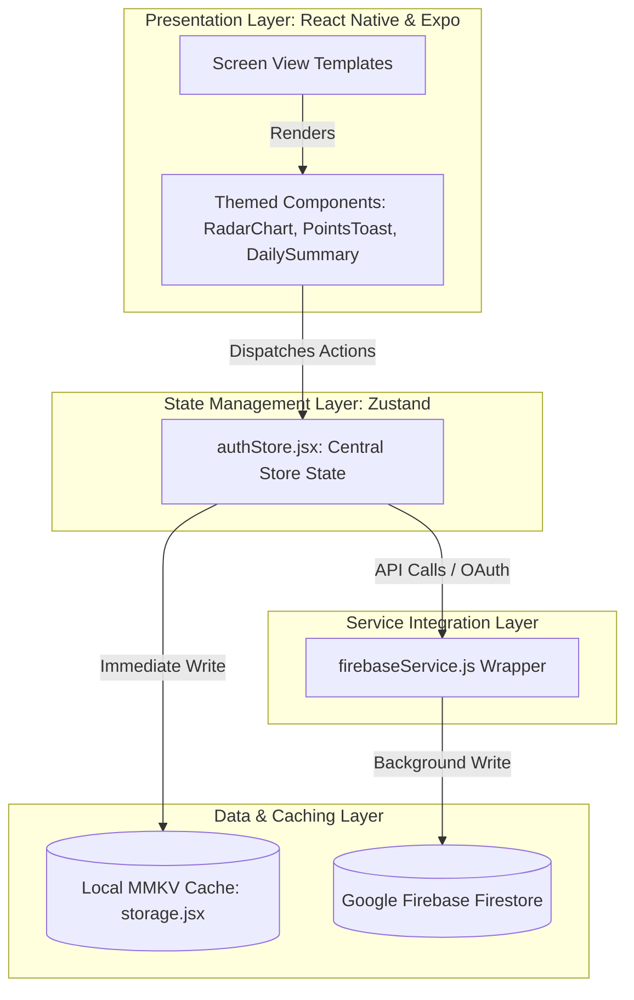
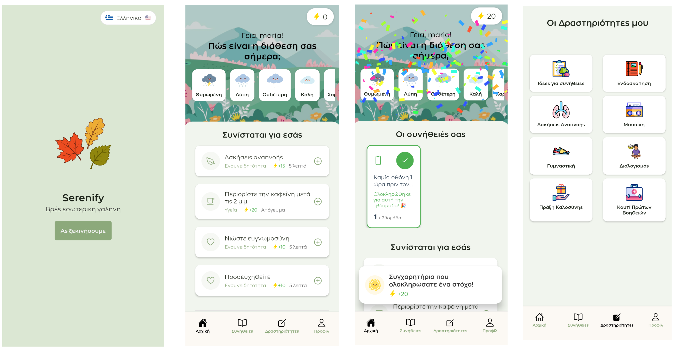
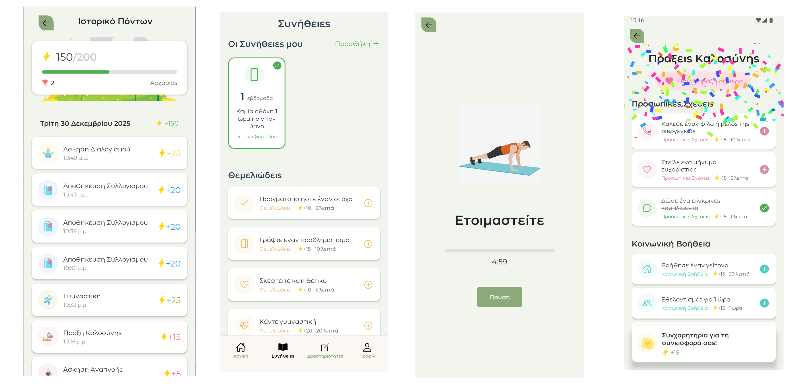
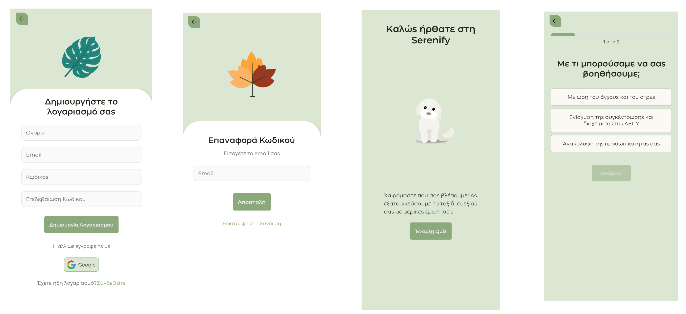

# Serenify

**Serenify** is a comprehensive mobile self-care helper designed to support users' mental well-being. Built on **React Native** and powered by **Expo**, it encourages positive daily habits, mindfulness exercises, and emotional reflections through gamified progression (points, levels, streaks, and achievements). 


## Key Features

### 1. Onboarding & Diagnostics
*   **Interactive Onboarding Quiz:** Tailored questionnaire analyzing user stress levels, sleep cycles, focus areas, and emotional states.
*   **Automatic Habit Setup:** Dynamically pre-configures a set of foundational habits matching the user's primary focus areas (e.g., Sleep, Stress Management, Physical Wellness).

###  2. Gamified Habit Tracking
*   **Frequency-Aware Scheduling:** Supports habits trackable on specific days, multiple times a week, or daily.
*   **Resilient Streaks:** Custom frequency formulas calculate streaks accurately—streaks only break if the habit’s specific interval is missed.
*   **Leveling System:** Gain points (+10 or category bonus) for completing activities. Every 100 points triggers a Level Up, advancing through ranks (Beginner ➔ Intermediate ➔ Advanced ➔ Master) with celebratory confetti.
*   **Optimistic Feedback:** Screen actions register instantly on the UI, updating points and progress rings before waiting on database roundtrips.

### 3. Daily Mood Logging
*   **Expressive Mood Picker:** Log how you feel with dynamic emotion tags.

### 4. Interactive Wellness Hub
*   **Paced Breathing:** Animated breathe-in/breathe-out guiding layouts to reduce anxiety.
*   **Meditation Timer:** Clean focused timers with ambient audio soundscapes.
*   **Movement Routines:** Curated physical stretching prompts with difficulty scales.
*   **Soundscapes:** Built-in audio player featuring tranquil nature tones and relaxing audio.
*   **Acts of Kindness:** Log daily altruistic actions to cultivate empathy and community connection.
*   **Reflections Diary:** Prompt-based daily journaling to capture highlights and emotional state.

### 5. Emergency First Aid Kit
*   **5-4-3-2-1 Grounding:** A sensory-based walkthrough (seeing, feeling, hearing, smelling, tasting) to arrest active panic attacks.
*   **Progressive Muscle Relaxation (PMR):** Guided animations and steps to release physical tension.
*   **Worry Journal:** Write down racing worries, and physically tap to delete/destroy them—symbolizing letting go.

### 6. Engineering Quality & Localisation
*   **Cache-First Syncing:** Immediate local persistence via MMKV with asynchronous background Firestore database sync.
*   **Bilingual Localization:** Fully localized in **English (EN)** and **Greek (EL)** with run-time translation switching.

---

## Technologies Used
[](https://reactnative.dev/) 
[](https://expo.dev/) 
[](https://firebase.google.com/) 
[](https://github.com/pmndrs/zustand) 
[](https://github.com/mrousavy/react-native-mmkv) 
[](https://react-native-async-storage.github.io/async-storage/) 

- **React Native** – UI components
- **Firebase** – Database Management
- **MMKV**  – Caching 
- **Zustand** - State Management
- **Async Storage** - Authentication tokens

---

## System Architecture
Serenify is structured around a clean **4-Layer Architecture** that isolates visual layouts from business logic, cloud communication, and device storage.

### Layer Diagram


---

## Project Structure

```
Serenify/
├── app/                      # Expo Router App Pages (File-based Navigation)
│   ├── (auth)/               # User authentication flows (Login, Register, Forgot Password)
│   ├── (dashboard)/          # Main dashboard screens (Daily index, Profile, Habits, Activities hub)
│   ├── (activities)/         # Interactive exercises (Kindness logger, Breathing, Soundscapes)
│   │   └── firstaid/         # Emergency interventions (Grounding, Muscle relaxation, Worry journal)
│   ├── (questionnaire)/      # Initial diagnostic onboarding flow & results analysis
│   ├── (modals)/             # Full-screen dialogs (Add habits, Habit frequencies, Stats, Points history)
│   ├── config/               # Firebase app/auth initialization
│   ├── services/             # firebaseService.js (Firestore & Google Sign-In wrapper)
│   └── utils/                # customAlert.js utility wrapper
├── assets/                   # Static resources
│   ├── animations/           # Lottie animations for celebrations, breathing, & grounding
│   ├── pictures/             # Application screenshot collages & visual assets
│   ├── sounds/               # Audio files for soundscapes & meditation
│   └── fonts/                # Custom brand typography
├── components/               # Reusable styled UI elements (DailySummary, RadarChart, ProgressRing, Themed UI)
├── constants/                # App constants & business rules
│   ├── Colors.js             # Calm pastel color definitions
│   ├── habitFrequency.js     # Complex formulas for frequency, streaks, and points
│   └── translations.js       # Localization hooks & setup
├── store/                    # Zustand global stores (authStore) & MMKV storage driver
├── translations/             # i18next translation resource files (en.json, el.json)
├── serenify-automation.ps1  # Developer setup & script runner (PowerShell)
├── package.json              # App configuration, scripts, and dependencies
└── tsconfig.json             # TypeScript compiler rules
```

---

## Environment Configuration

Before running the application, you must configure a local `.env` file at the root of the project containing your Firebase project variables:

```env
# Firebase Connection Configuration
EXPO_PUBLIC_FIREBASE_API_KEY=your_firebase_api_key
EXPO_PUBLIC_FIREBASE_AUTH_DOMAIN=your_project_id.firebaseapp.com
EXPO_PUBLIC_FIREBASE_PROJECT_ID=your_project_id
EXPO_PUBLIC_FIREBASE_STORAGE_BUCKET=your_project_id.appspot.com
EXPO_PUBLIC_FIREBASE_MESSAGING_SENDER_ID=your_messaging_sender_id
EXPO_PUBLIC_FIREBASE_APP_ID=your_firebase_app_id

# Auth Credentials
EXPO_PUBLIC_GOOGLE_WEB_CLIENT_ID=your_google_web_client_id_for_oauth
```

---

## Getting Started

### Method 1: Automated Script (Windows PowerShell)

We provide a comprehensive automation suite to simplify environment checks, configuration, cache clears, and platform compilation:

1. Open PowerShell inside the project root directory.
2. Load the automation runner:
   ```powershell
   . .\serenify-automation.ps1
   ```
3. Use the integrated command aliases:

| Cmdlet | Short Alias | Purpose |
|---|---|---|
| `Initialize-Serenify` | — | Removes stale `node_modules`, installs npm dependencies, and checks `.env`. |
| `Start-Serenify` | `serenify` | Starts the Metro bundler server. Supports `-Mode clear`, `-Mode tunnel`, `-Mode lan`. |
| `Start-SerenifyAndroid` | `serenify_android` | Boots up the app on your active Android emulator (supports `-Clean` flag). |
| `Reset-Serenify` | `serenify_reset` | Deep clears Metro cache, removes `.expo` logs, and reinstalls clean node packages. |
| `Get-SerenifyStatus` | `serenify_status` | Audits Node, npm, dependency installation status, and environmental keys. |

### Method 2: Manual Initialization

If you prefer standard CLI tools, run these commands:

1. **Install dependencies:**
   ```bash
   npm install
   ```
2. **Launch Metro Bundler:**
   ```bash
   npx expo start
   ```
3. **Run on specific platforms:**
   *   **Android:** Press `a` in Metro terminal or execute `npx expo run:android`
   *   **iOS:** Press `i` in Metro terminal or execute `npx expo run:ios`
   *   **Web:** Press `w` in Metro terminal or execute `npm run web`

---

## Screenshots (Greek Localisation)

### Main Dashboard & Menu Interfaces


### Wellness Activities Hub


### Authentication & Intake Questionnaire



## License

Distributed under the **MIT License**. See `LICENSE` for more information.

---
